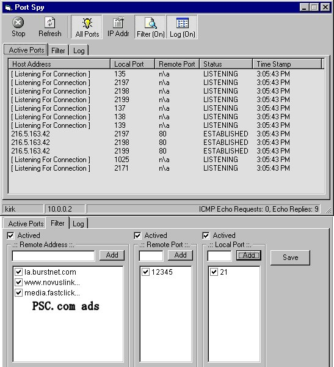



## Port Spy

### Description

One gient leap towards a genuine FIREWALL in visual basic. With this you can block connections based upon ip address, local port number, or remote port number. To do this it relies on the TCP table and NOT opening sockets and then setting them to listen. This is an advanced TCP monitor and blocker. I also added a test connection form that will try to connect to the selected ip and show any data that was sent. You can kill all those annoying ads when using ICQ or anything for that matter that is adware. Just simply add the address of the ad server to the block list. The source is fully commented. This being the first release there will no doubt be things that I may have overlooked. I have spent a great deal of time in putting this program to the test. I would greatly appreciate any comments and suggestions.
 
### More Info
 

             |
---                |---
**Submitted On**   |2001-11-13 17:19:34
**By**             |[Gregory Kirk](https://github.com/Planet-Source-Code/PSCIndex/blob/master/ByAuthor/gregory-kirk.md)
**Level**          |Advanced
**User Rating**    |4.1 (98 globes from 24 users)
**Compatibility**  |VB 6\.0
**Category**       |[Complete Applications](https://github.com/Planet-Source-Code/PSCIndex/blob/master/ByCategory/complete-applications__1-27.md)
**World**          |[Visual Basic](https://github.com/Planet-Source-Code/PSCIndex/blob/master/ByWorld/visual-basic.md)
**Archive File**   |[Port\_Spy3513511132001\.zip](https://github.com/Planet-Source-Code/gregory-kirk-port-spy__1-28884/archive/master.zip)

